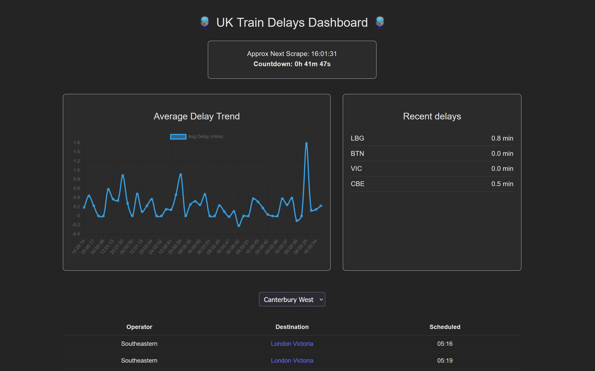
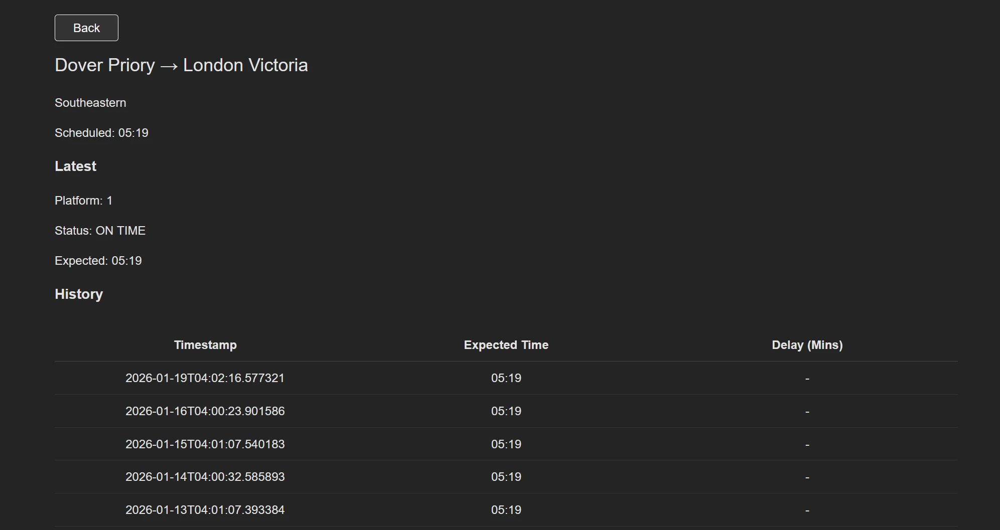

<h1>🚆 Train Delays Dashboard</h1>

A full-stack data project that tracks UK train delays over time by scraping live departure data, normalising it into a relational database, and visualising trends in a lightweight dashboard.

This project was built to demonstrate real-world backend and data engineering skills: working with external APIs, building reliable pipelines, designing schemas, and deploying production services.

<h2>📊 What the project does</h2>

    Scrapes live train departure data from the TransportAPI

    Normalises raw API responses into structured relational models

    Stores historical snapshots to track how delays change over time

    Computes aggregate metrics (e.g. average delay per scrape)

    Exposes data via a Flask API

    Displays trends in a lightweight frontend dashboard

    The scraper runs on a schedule and continuously builds a growing historical dataset

<h2>🌍 Live Demo</h2>

    Note: The deployed services may take up to 30 seconds to wake up on first visit due to hosting cold starts. 
    If it seems to be stuck after 20-30 seconds, refresh the page to allow it to work correctly.

    Frontend:
    https://train-delays.vercel.app/

    Backend:
    https://train-delays-production.up.railway.app/

<h2>✍️ Why this project exists</h2>

    This project was built to demonstrate:

        Backend engineering skills applied to real-world data

        Data modelling and pipeline design

        Handling production issues like cold starts and transient failures

        Comfort deploying and maintaining live services

        Ability to design and build an end-to-end system independently

<h2>🧱 Tech Stack</h2>

<h3>Backend</h3>

    Python

    Flask

    SQLAlchemy + Postgres

    Railway (API + scheduled scraper)

    Architecture & Data Design

    Relational schema design

        Data normalisation

        Upserts and snapshot history

        Logging and scrape summaries

        Retry logic for production reliability (cold starts, sleeping DB, etc.)

<h3>Frontend</h3>

    Minimal React UI, designed to support and showcase backend functionality

    Focused on clarity rather than heavy frameworks

<h2>🧠 Key Engineering Considerations</h2>

    This project intentionally handles realistic production concerns, including:

        Cold starts from hosted databases

        Retry logic to handle transient DB failures (e.g. initial connection failures on wake)

        Defensive handling for sleeping databases during scheduled scrapes

        Structured logging for observability

        Separation of raw data → normalised models

        Avoiding duplicated records via deterministic upserts

        Historical snapshots for trend analysis

    These were driven by real issues encountered during deployment, rather than being added artificially.

<h2>🛠️ Running Locally</h2>

    Backend:

        cd backend
        python -m venv venv
        pip install -r requirements.txt
        flask run

        Requires environment variables (see backend/.env.example)

    Scraper:

        python scraper.py

    Frontend:

        cd frontend
        npm install
        npm run dev

    The project is designed so the backend, scraper, and dashboard can all be run independently during development.

<h2>🗂️ Project Structure (high level)</h2>

    train-delays/
    ├── backend/
    │   ├── db/
    │   ├── routes/
    │   ├── services/
    │   │   ├── __init__.py
    │   │   ├── scraper.py
    │   │   ├── transform.py
    │   │   ├── transport_api.py
    │   ├── app.py
    │   ├── config.py
    │   ├── requirements.txt
    │   ├── seed_stations.py
    │
    └── docs/
    │   ├── screenshots/
    │
    └── frontend/
        ├── src/
        │   ├── api/
        │   ├── components/
        │   ├── pages/
        │   ├── app.jsx
        │   ├── main.jsx
        ├── vite.config.js
        ├── vercel.json

<h2>🖼 Screenshots</h2>

<i>Dashboard</i>

 

<i>Service Detail</i>

 

<h2>🚧 Possible Improvements</h2>

    Support for more stations to widen the dataset

    Stronger visualisations

    Alerting on severe delays

    Public API documentation

    Containerised local setup

    Increase scraping frequency to make trends more responsive and useful

<h2>🧩 Lessons Learned</h2>

    A few things this project reinforced:

        Deployed systems behave differently from local ones (e.g. infrastructure quirks, transient failures)

        Pipelines need defensive logic, not just happy-path code

        Schema design matters early when collecting historical data

        Logging becomes essential once something runs unattended

    These are the kinds of problems I wanted to practise solving with this project.
